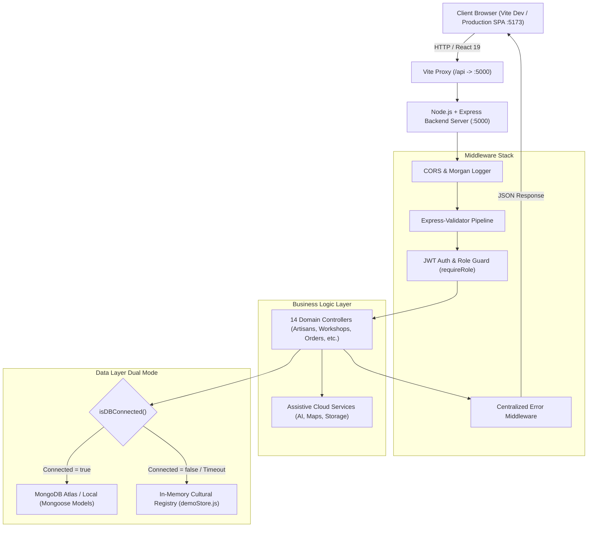
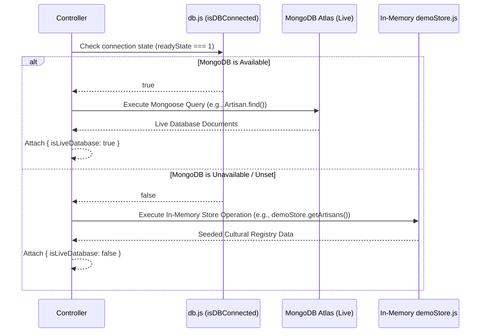

# JEEVANT: LIVING INDIA — Architecture & System Design
**Smart India Hackathon 2026 | Problem Statement ID: 26197 | Theme: Heritage & Culture**

---

## 1. High-Level System Architecture



---

## 2. Frontend Architecture

### Core Technologies
- **React 19.2.8**: Component-based user interface with fine-grained reactivity.
- **Vite 8.2.2**: Fast module bundler and development server with integrated API proxying.
- **React Router DOM v7.18.3**: Declarative client-side routing.
- **Lucide React**: Vector icons tailored for cultural, administrative, and commerce UI.

### Component & Layout Hierarchy
```
App.jsx
 ├── AdminProvider (AdminContext.jsx — Platform State & Actions)
 └── BrowserRouter
      ├── LearnerLayout (Navbar, Ticker, Notifications, CartDrawer, Cultural Footer)
      │    ├── Home (Cinematic Hero, Regional Explorer, Featured Artisans, Workshops)
      │    ├── Explore & Discover (Tradition catalog, risk status filters)
      │    ├── CultureMap (Interactive Geographic cluster explorer)
      │    ├── ArtisanDirectory & ArtisanProfile (GI verified master craftspeople)
      │    ├── Shop & ProductDetail (0% fee fair-trade e-commerce)
      │    ├── WorkshopList & WorkshopDetail (Live interactive masterclasses)
      │    ├── Learn (Knowledge modules & quizzes)
      │    ├── SearchResults (Cross-entity unified search)
      │    ├── UserDashboard (Enrolled masterclasses, orders, saved traditions)
      │    └── ArtistDashboard (Artisan inventory, masterclasses, DBT ledger)
      ├── Standalone Routes
      │    ├── LoginPage & SignupPage
      │    └── ArtisanRegister (Public 4-step onboarding application)
      └── Admin Layout (Sidebar, Header, Admin Notification Queue)
           ├── Dashboard (Live KPIs, pending verification queue)
           ├── Artisans (GI verification, approve/reject workflow)
           ├── Users (User role administration & activation)
           ├── Traditions (Intangible heritage registry management)
           ├── Workshops (Masterclass scheduling & seat audits)
           ├── Reports (Cultural grievance moderation)
           ├── Payments (0% commission DBT disbursement audits)
           ├── Reviews (Patron review moderation)
           └── Settings (Governance presets & verification policies)
```

---

## 3. Dual-Mode Data Layer Architecture

JEEVANT implements an in-memory fallback strategy that guarantees **100% platform availability**:



### Advantages of the Dual-Mode Pattern:
1. **Zero Setup Friction**: Evaluators and hackathon judges can immediately clone and run the application without installing or configuring local databases.
2. **True Statefulness in Memory**: `demoStore.js` implements complete relational updates (creating orders records DBT payouts, workshop bookings decrement real-time seat capacity, artisan approvals update live badge statuses).
3. **Seamless Transition**: Once `MONGO_URI` is populated, the backend automatically transitions to live MongoDB without code modifications.

---

## 4. Authentication & Role-Based Access Control (RBAC)

JEEVANT enforces a stateless, token-based authentication system using JSON Web Tokens (JWT):


### Supported User Roles:
- **`admin`**: Full access to Nodal Ministry governance, GI artisan verification, moderation, user audits, and DBT ledgers.
- **`artisan`**: Access to Artist Studio Dashboard, craft listing, masterclass scheduling, and DBT earnings tracking.
- **`learner`**: Public patron exploring traditions, enrolling in masterclasses, purchasing crafts, saving bookmarks, and writing verified reviews.

---

## 5. Direct Benefit Transfer (DBT) & Fair-Trade Guarantee

A core pillar of Problem Statement 26197 is eliminating intermediary exploitation of rural artisans:
1. **0% Intermediary Deductions**: Platform fee is strictly locked to ₹0 (`platformCommission: "0%"`).
2. **Direct Artisan Disbursal**: 100% of the item purchase price transfers directly to the artisan's linked Aadhaar/DBT bank account.
3. **Immutable Payment Ledger**: Every transaction automatically generates an audited payment record with a unique UTR number and timestamp visible in both the Artisan Studio and Admin Governance Console.
